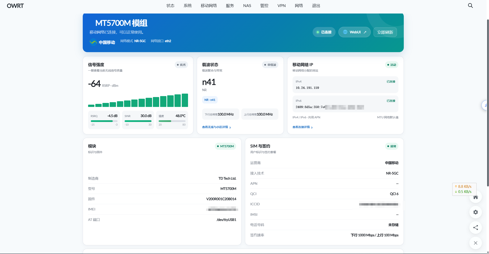
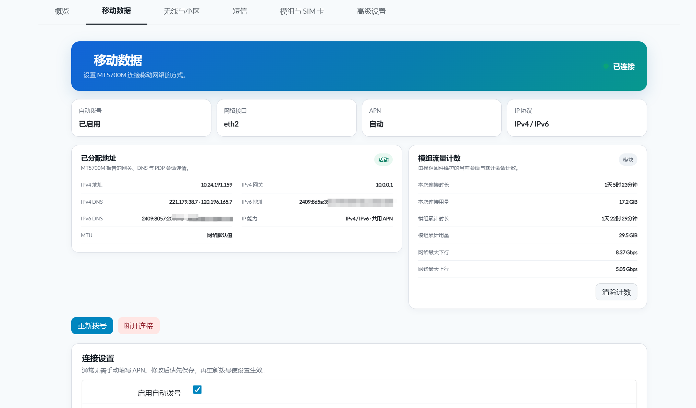
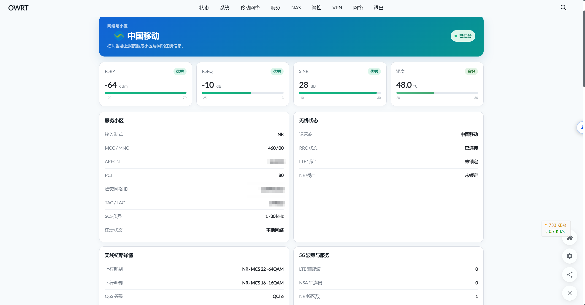

<div align="center">

# MT5700M Manager for OpenWrt

**面向移远 MT5700M-CN 5G 模组的 OpenWrt LuCI 管理器**

统一管理状态、移动数据、网络与小区、短信、系统维护与 AT 终端，并按 MT5700M 手册识别 USB 正常 / 升级 / Dump 模式。

[](https://github.com/LianXia233/luci-app-mt5700m/actions/workflows/ci.yml)
[](https://github.com/LianXia233/luci-app-mt5700m/actions/workflows/release.yml)
[](LICENSE)

</div>

---

## 目录

- [项目简介](#项目简介)
- [界面预览](#界面预览)
- [主要功能](#主要功能)
- [安装与编译](#安装与编译)
- [依赖说明](#依赖说明)
- [流量历史](#流量历史)
- [WebUI 独立前端（mt5700webui）](#webui-独立前端mt5700webui)
- [版本信息](#版本信息)
- [设计边界与许可](#设计边界与许可)

---

## 项目简介

本项目是一个专门面向 **移远 MT5700M-CN 5G 模组** 的 OpenWrt LuCI 管理器。它将状态、移动数据、网络与小区、短信、系统维护和 AT 终端统一到一个应用中，并按照 MT5700M 手册识别 **USB 正常 / 升级 / Dump** 三种模式。

- 简体中文界面
- 不依赖云服务，不上传模组或 SIM 数据
- 版本采用标准的 `主版本.次版本.修订版本-r打包修订` 格式（如 `2.3.33-r1`）

## 界面预览

<table>
  <tr>
    <td width="50%">
      <br>
      <b>概览页</b><br>
      首页集中展示 RSRP / RSRQ / SINR / 温度、NR-n41 载波状态、IPv4/IPv6 双栈地址、模组固件、IMEI 与 SIM 签约速率。
    </td>
    <td width="50%">
      <br>
      <b>移动数据</b><br>
      配置自动拨号 / 网络接口 / APN / IP 协议，查看已分配地址、IPv4 DNS、IPv6 PD / DNS 以及模组原生流量计数。
    </td>
  </tr>
  <tr>
    <td width="50%">
      <br>
      <b>网络与小区</b><br>
      服务小区、接入制式、MCC/MNC、ARFCN、PCI 与无线链路详情（NR-MCS、上下行调制、QoS）；5G 波束数与 NSA 辅连接可视化。
    </td>
    <td width="50%">
      <br>
      <b>SSB 波束与 NR 邻区</b><br>
      可视化 7 路 SSB 波束的 RSRP / SINR 强度；支持 NR 邻区的入驻、锁定、刷新状态与小区扫描控制。
    </td>
  </tr>
</table>

## 主要功能

| 模块 | 能力 |
| --- | --- |
| **首页概览** | 信号质量、载波聚合、IPv4/IPv6 与移动流量优先展示；RSRP / RSRQ / SINR 等信号质量人性化显示 |
| **移动数据** | 网关、DNS、PDP 会话和模组原生计数集中管理；APN、PDP、漫游和移动数据连接管理 |
| **模组与 SIM 卡** | 模组身份、手机号、SIM 信息和签约速率集中展示 |
| **网络与小区** | 网络制式、LTE/WCDMA 频段及小区锁定 |
| **短信** | 短信收发与联系人友好的列表界面 |
| **系统维护** | IMEI、手机号、签约速率、USB/网口状态及系统维护 |
| **高级** | 统一收纳 USB/PCIe、通信诊断和 MT5700M 专用 AT 终端入口 |
| **其它** | 定期缓存模组温度，供 H5000M 风扇控制等本机组件低开销共享 |

## 安装与编译

源码包位于 `luci-app-mt5700m/`，按以下步骤编译安装：

```sh
# 1. 克隆仓库
git clone https://github.com/LianXia233/luci-app-mt5700m.git

# 2. 复制到 OpenWrt 源码包目录
cp -a luci-app-mt5700m/luci-app-mt5700m /path/to/openwrt/package/

# 3. 配置并编译
make menuconfig
# LuCI -> Applications -> luci-app-mt5700m
make package/luci-app-mt5700m/compile V=s
```

每个 GitHub Release 均由 GitHub Actions 使用官方 OpenWrt SNAPSHOT `mediatek/filogic` SDK 在线构建，附带：

- 应用本体与中文语言包
- 两个底层传输包（AT 与短信）
- SDK 构建公钥与 SHA256 校验文件

> 安装时必须使用与设备固件 ABI / 内核版本相匹配的软件源。

## 依赖说明

应用依赖以下组件：

- `ubus-at-daemon`
- `sms-tool_q`
- OpenWrt 官方 USB 串口 / 网卡内核模块（`kmod-usb-serial`、`kmod-usb-net-cdc-ether`、`kmod-usb-net-cdc-ncm` 等）

## 流量历史

流量历史由应用直接读取 MT5700M 数据接口的内核计数，**不依赖 `vnStat`**，并保存在 `/etc/mt5700m/traffic-history`。

- 升级自早期独立流量插件时会自动迁移已有记录
- 不再安装或显示单独的“流量统计”应用

## WebUI 前端（mt5700webui 3.0.2）

[`mt5700webui-openwrt-server/`](mt5700webui-openwrt-server/VENDOR.md) 归档了上游 [inotdream/mt5700webui-openwrt-server](https://github.com/inotdream/mt5700webui-openwrt-server) v3.0.2 的完整源码与 aarch64_cortex-a53 预编译包，作为本应用的 WebUI（React + Semi Design，访问 `http://<路由器地址>/5700/`）。

- 上游 Go 后端（`at-webserver`）通过 WebSocket 直连模组 AT 口，与本应用的 LuCI 管理页互补
- 本仓库在归档基础上新增了 **Go 后端的 Python 移植版** `at-webserver.py`（pyserial + websockets，单文件）：
  Go 版二进制在 ImmortalWrt 6.18 内核（n_tty 重构）上存在串口空闲读被误判 EOF 的兼容问题，
  Python 版在同一内核上实机验证稳定，协议与 Go 版完全一致
- **v2.3.41 起旧的 umi 前端与 `at-server.py` 已从仓库移除**，构建时由
  `scripts/build-release.sh` 把 3.0.2 前端（`www/5700`）与 Python 后端折叠进
  `luci-app-mt5700m` 包，单个安装包即包含前端 + 后端 + LuCI 管理页
- **v2.3.42 起后端默认走 UBUS**（经 `ubus-at-daemon` 转发 AT 命令），与 LuCI 管理页
  共享同一个 AT 口：WebUI 与模组管理功能可同时使用，不会争抢 PCUI 串口。
  代价是无主动上报通道（来电/新短信实时推送不可用），需要时可在
  `/etc/config/at-webserver` 切 `connection_type='SERIAL'` 并停用 `ubus-at-daemon`
- 实机部署差异、文件冲突处理与验证记录见 [`mt5700webui-openwrt-server/VENDOR.md`](mt5700webui-openwrt-server/VENDOR.md)

## 版本信息

| 版本 | 说明 |
| --- | --- |
| `2.3.43-r1` | 当前开发版本（OpenWrt 安装包，WebUI 3.0.2 + Python 后端，AT 通道 UBUS 共享） |

版本演进与修复记录见 [CHANGELOG.md](CHANGELOG.md)。

## 设计边界与许可

本项目**不是通用蜂窝模组框架**，只实现 MT5700M 所需的能力。

- 低层 AT 与短信传输包来自固定版本的 [FUjr/QModem](https://github.com/FUjr/QModem)，应用内的精简实现保留了来源说明，详见 [`QMODEM-NOTICE`](luci-app-mt5700m/root/usr/share/mt5700m/QMODEM-NOTICE)。该部分受其上游 MPL-2.0 和非商业限制约束，适用于个人、非商业用途。
- 本仓库自行编写的代码按 [Apache License 2.0](LICENSE) 发布。
