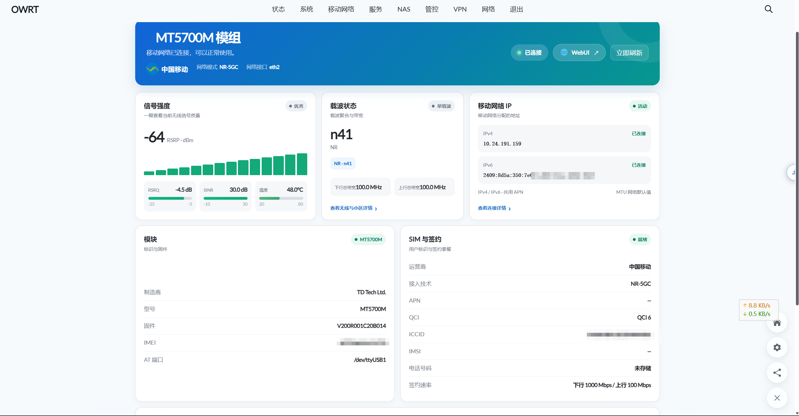
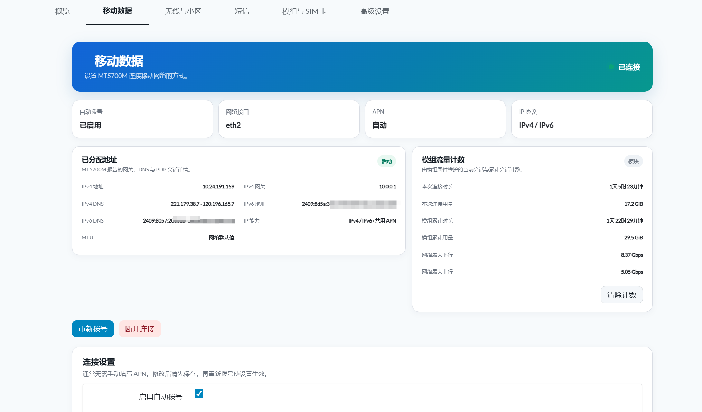
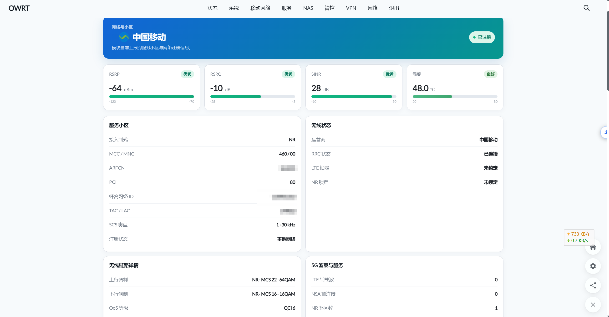
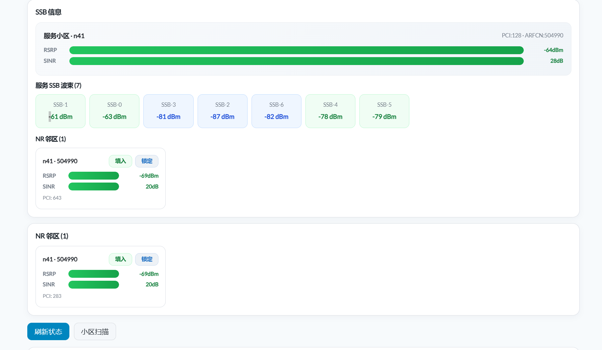
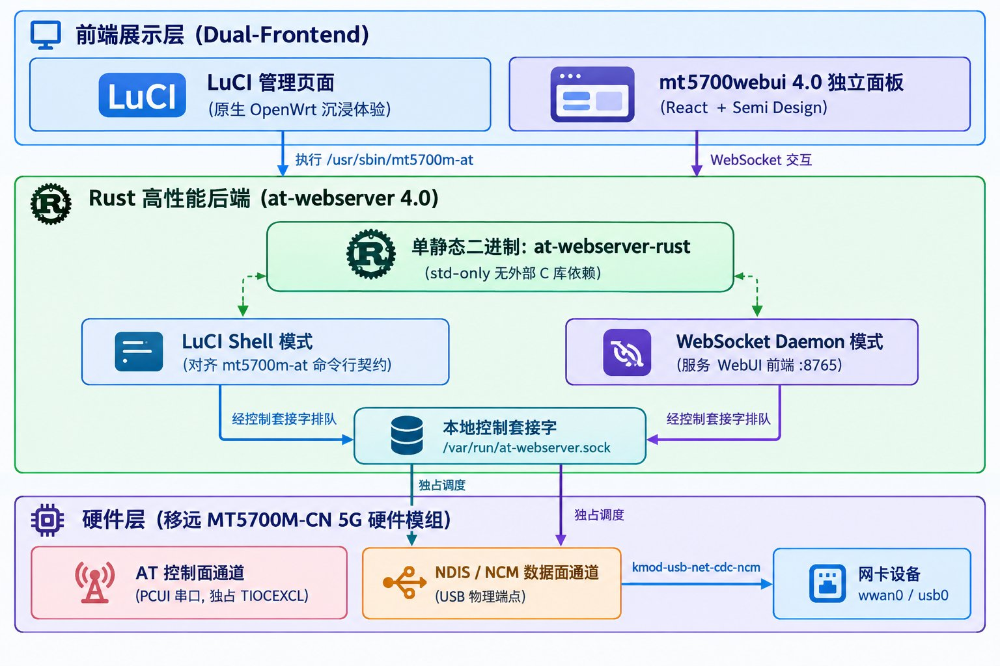
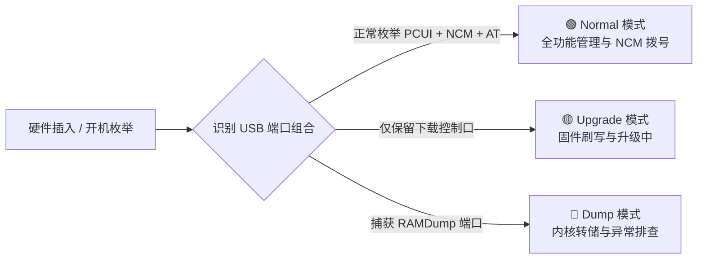
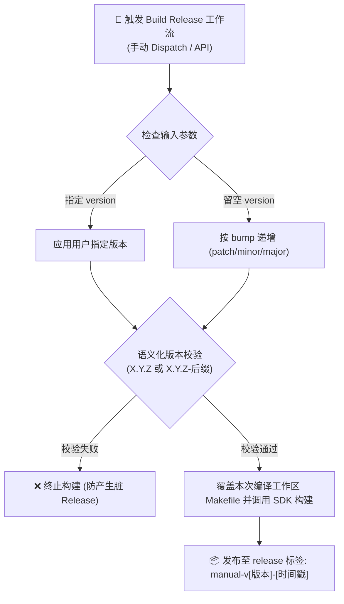

<div align="center">

# MT5700M Manager for OpenWrt

**面向移远 MT5700M-CN 5G 模组的高性能 OpenWrt LuCI 管理器与 Web 控制中心**

统一聚合状态监控、NCM 移动数据、小区与 7 路 SSB 波束、短信中心、原生流量统计与专用 AT 终端，并按 MT5700M 手册精准识别 USB 正常 / 升级 / Dump 硬件模式。

[](https://github.com/LianXia233/luci-app-mt5700m/actions/workflows/ci.yml)
[](https://github.com/LianXia233/luci-app-mt5700m/actions/workflows/release.yml)
[](https://github.com/LianXia233/luci-app-mt5700m/releases)
[](https://openwrt.org/)
[-DEA584.svg?style=flat-square&logo=rust)](mt5700webui-openwrt-server/at-webserver/)
[](https://github.com/inotdream/mt5700webui-openwrt-server)
[](LICENSE)

<p align="center">
  <b>单包交付</b>：LuCI 原生视图 + WebUI 4.0 独立前端 + Rust 双入口后端一键集成<br>
  不依赖外部云端、不上传 SIM 隐私、零第三方 Rust 依赖、原生内核流量统计
</p>

</div>

---

| 属性维度 | 说明与工程规范 |
|:--|:--|
| **软件包名** | `luci-app-mt5700m`（单包内嵌 LuCI 前端、独立 WebUI 与 Rust 后端） |
| **适配硬件** | 移远 Quectel MT5700M-CN 5G 模组 |
| **数据面拨号** | NCM 协议（基于 `kmod-usb-net-cdc-ncm`，高吞吐低开销） |
| **控制面通讯** | Rust 后端独占 AT 串口（TIOCEXCL），LuCI 走本地控制套接字、WebUI 走 WebSocket，免第三方 `ubus-at-daemon` |
| **访问入口** | LuCI 路径：`调制解调器` → `MT5700M 管理` · WebUI 独立路径：`http://<路由器IP>/5700/` |

---

## 界面预览

<div align="center">

| 概览页 (Dashboard) | 移动数据 (Mobile Data) |
|:---:|:---:|
|  |  |
| 实时 RSRP/RSRQ/SINR、模组温度、载波聚合 (NR-n41)、IPv4/IPv6 双栈及 SIM 签约速率 | APN/PDP 配置、IPv4 DNS/IPv6 PD 分配、接口 MTU 与模组原生流量计数 |
| **网络与小区 (Cell & Radio)** | **SSB 波束与 NR 邻区 (Beams & Scan)** |
|  |  |
| 服务小区 ARFCN/PCI、上下行调制阶数 (NR-MCS)、QoS 参数及 5G 波束可视化 | **7 路 SSB 空间波束**强度 RSRP/SINR 谱、NR 邻区监听、小区锁定与扫频 |

</div>

---

## 系统拓扑与多层协同架构

系统采用**双前端共用统一后端通道**的设计，由 Rust 后端 `at-webserver` 独占 AT 串口
（TIOCEXCL + 常驻描述符），LuCI 与 WebUI 都经它访问模组，彻底避免传统工具在 Web
与后台同时调用时出现的 TTY 串口锁死。`ubus-at-daemon` 与 `sms-tool_q` 已完全移除。

<div align="center">
  
</div>

---

## 异步化架构（Async Architecture）

从 v2.7 起，Rust 后端在「独占 AT 通道」基础上进一步升级为**事件驱动 + 异步任务调度 + 状态缓存 + 实时事件推送**架构。核心目标：**任何单个慢 AT 操作都不能阻塞 LuCI / WebUI / WebSocket**，页面打开不等待模组，多个页面共享缓存、不再重复请求，后台轮询统一收敛、不再浪费串口与 CPU。

### 总体分层

```
┌──────────────────────────┐   LuCI / WebUI 前端
│  快速读缓存 / 下发任务    │   读取 StateCache 快照（SWR），订阅事件
└────────────┬─────────────┘
             ▼
┌──────────────────────────┐
│  WebSocket（事件驱动）    │   subscribe / unsubscribe / snapshot 控制帧
└────────────┬─────────────┘   实时推送 {type, data, timestamp} 事件
             ▼
┌──────────────────────────────────────────────────────────┐
│ Async Application Core                                     │
│   ┌───────────┐ ┌──────────────┐ ┌────────────────────┐  │
│   │ StateCache │ │ TaskManager  │ │ EventBus           │  │
│   │  (SWR/TTL) │ │ 生命周期/周期 │ │ (主题/合并/即时)    │  │
│   └─────┬─────┘ └──────┬───────┘ └─────────┬──────────┘  │
└─────────┼──────────────┼──────────────────┼──────────────┘
          │              │                  │
          └──────────────┼──────────────────┘
                         ▼
┌────────────────────────────────────────┐
│ AtArbiter：AT 请求队列 / 仲裁器          │  单执行线程 · 优先级 · 去重 ·
│ 超时 · 重试 · 独占 · 背压 · 协作取消     │  慢 AT 不再卡死任何路径
└──────────────────┬─────────────────────┘
                   ▼
┌────────────────────────────────────────┐
│ AtTransport：串口(TIOCEXCL) / 网络 AT    │
└──────────────────┬─────────────────────┘
                   ▼
              MT5700M 模组
```

### 关键机制

| 机制 | 说明 |
|:---|:---|
| **统一 AT 仲裁器** | 所有 AT 交换（WebSocket 命令、LuCI 控制套接字、后台采集、扫频、锁频调度）都经 `AtArbiter` 单执行线程串行化：一次一条命令，响应不交错；优先级（Critical > Interactive > High > Normal > Background）保证用户操作不被后台轮询饿死 |
| **请求去重** | 同一时间相同只读请求（如多个页面同时 `AT+CSQ`）合并为一次 AT 交换，结果共享 |
| **StateCache（SWR）** | 后台采集器周期性把 signal / network / registration / temperature / traffic / cell / sim / modem 写入缓存，每项含 `value + timestamp + ttl + source`；页面读到过期值仍立即返回（Stale-While-Revalidate），同时后台刷新 |
| **事件总线 EventBus** | 主题订阅/发布，高频遥测 100ms 窗口合并（coalescing），task / usb / modem / sms / scan 即时直推；状态变化 → 事件 → WebSocket → 订阅前端，前端不再自己轮询 |
| **TaskManager** | 统一任务模型 `Queued → Running → Completed/Failed/Cancelled/Timeout`；支持进度事件、取消（注入线缆上的 abort）、看门狗超时、周期任务（互不重叠、后台优先级、记录上限 512 / 300s TTL） |
| **周期采集** | signal 2s、registration 3s、network 3s、temperature 5s、traffic 5s、cell 10s、sim 30s、modem info 60s——全部 Background 优先级，经 AT 仲裁器去重排队，约 93 次快查询/分钟，远低于一次串行交换每秒 |
| **USB 热插拔** | DeviceMonitor 监听 USB 增删/重置，变化时：失效缓存 → 取消失效任务 → 重连 transport → 刷新状态 → 推送 `usb.*` / `modem.*` 事件 |
| **慢任务隔离** | 扫频、短信收发、PDP 操作、网络恢复等一律后台执行；HTTP/WS 请求立即返回 `task_id`，结果通过 `task.*` 事件推送 |
| **错误模型与重试** | 统一 `ModemUnavailable / TransportError / AtTimeout / AtRejected / Busy / TaskCancelled / TaskTimeout / InvalidParameter / PermissionDenied / UsbDisconnected / InternalError`，机器可读 `code` + 人类可读 `message` + `retryable`；超时/传输瞬时故障带退避重试，参数错误/模组明确拒绝绝不盲目重试 |

### 前端配合（零轮询）

- **LuCI**：`mt5700m-at cached` 子命令 + `/var/run/at-webserver.sock` 读取 StateCache 快照，状态页 `status.js` 双阶段渲染（缓存秒开 → 事件/命令补齐）。
- **WebUI**：连接后先请求 `{action:"snapshot"}` 控制帧拿到缓存快照（零 AT 流量秒开），再订阅 `subscribe` 主题；`signal.updated / network.updated / registration.updated / temperature.updated / traffic.updated / cell.updated / sim.updated / modem.info / usb.* / task.* / scan.* / sms.*` 事件实时更新页面；断线重连后自动重新订阅 + 拉快照，无需刷新页面。

> 兼容性：LuCI CLI 子命令契约、WebSocket 命令/应答协议、`AT+SCHED?`/`AT^CELLSCAN` 伪命令全部保持不变；新增的控制帧（`subscribe/unsubscribe/snapshot`）与 `cached` 子命令均为增量扩展，旧前端零改动即可继续工作。

## 硬件工作模式识别模型

应用根据移远 MT5700M 官方工程手册规范，实时探测 USB 枚举状态，动态判定当前硬件生命周期模式并显示对应的维护建议：


```mermaid
flowchart LR
    Start["硬件插入 / 开机枚举"] --> Detect{"识别 USB 端口组合"}
    Detect -->|正常枚举 PCUI + NCM + AT| Normal["🟢 Normal 模式<br/>全功能管理与 NCM 拨号"]
    Detect -->|仅保留下载控制口| Upgrade["🟡 Upgrade 模式<br/>固件刷写与升级中"]
    Detect -->|捕获 RAMDump 端口| Dump["🔴 Dump 模式<br/>内核转储与异常排查"]
```

---

## 主要功能矩阵

系统划分为七大功能模块，提供从网络层到底层芯片级的完整维测能力：

| 功能域 | 核心模块 | 详细能力说明 |
|:---|:---|:---|
| **核心状态** | **首页概览** | 聚合展示物理信号量（RSRP / RSRQ / SINR / 模组温度）、载波聚合状态、双栈 IP、模块固件版本与 IMEI |
| **移动网络** | **移动数据** | NCM 自动拨号接入、APN 配置、PDP 上下文控制、IPv4 DNS / IPv6 Prefix Delegation 获取与 MTU 优化 |
| **射频微测** | **网络与小区** | 锁定指定 5G NR / LTE 频段、ARFCN 频点与 PCI 物理小区；监听 NR-MCS 调制方式与下行 QoS |
| **波束感知** | **SSB 波束与邻区** | 针对 MT5700M 芯片深度呈现 **7 路空间 SSB 波束**强弱梯度分布；支持实时小区扫描与邻区常驻 |
| **信息服务** | **短信中心** | 支持 PDU / Text 短信收发、长短信自动分片重组及通讯录友好呈现，本地存储免泄露 |
| **系统维测** | **高级与 AT 终端** | MT5700M 专用 Web 终端（含语法高亮与常用模板）；USB / PCIe 通信链路状态深度诊断 |
| **本地监控** | **流量与温度调度** | 纯内核网卡计数器解析（**零依赖 vnStat**）；定时缓存模组温度供机壳风扇等脚本低开销共享 |

---

## 插件技术路线对比选型

本仓库与同系列的 [`luci-app-mt5700`](https://github.com/LianXia233/luci-app-mt5700) 均深度适配 MT5700M 模组，但底层通讯与设计哲学完全不同，请按需选型：

| 评估维度 | luci-app-mt5700m (本仓库) | luci-app-mt5700 |
|:---|:---|:---|
| **架构设计哲学** | 纯 LuCI 视图 + 轻量 Rust std 双入口后端 + 现代化独立 WebUI | 12 页深度控制台 + 常驻 Tokio 异步后台进程 |
| **底层拨号通路** | **NCM 拨号**（基于 `kmod-usb-net-cdc-ncm`，吞吐高、资源低） | **PCUI 串口 AT / NDIS 拨号**（对账容灾重试完善） |
| **AT 调度机制** | Rust 后端独占 TTY，内建指令排队调度机（本地控制套接字 + WebSocket 双入口共享） | **Rust 常驻进程独占 TTY**，内建指令排队调度机 |
| **特色专属功能** | **7 路 SSB 空间波束分析**、内置 WebUI 4.0 前端、免 vnStat 流量历史 | **全网基站扫频**、昼夜定时频段锁定、企业微信/Webhook 告警推送 |
| **开源许可规范** | **Apache-2.0**（主程序） / MPL-2.0（底层通信包） | **GPL-3.0** |

> [!CAUTION]
> **切勿同时安装两款插件！**  
> 两者均直接争夺 MT5700M 的 USB 通信端点与物理网络设备。在同一固件中同时安装会导致 AT 串口竞争撕裂及数据链路异常，同一设备仅能二选其一。

---

## 安装与编译

### 预编译包直接安装

GitHub Actions 定期使用官方 OpenWrt SNAPSHOT `mediatek/filogic` SDK 构建发布。在 [Releases](https://github.com/LianXia233/luci-app-mt5700m/releases) 页面获取对应安装包。

```sh
# 1. 安装核心依赖内核模块
opkg update
opkg install kmod-usb-serial kmod-usb-net-cdc-ncm kmod-usb-net-cdc-ether

# 2. 安装应用本体与中文语言包（Rust 后端已内建，无需单独的通讯中间件）
opkg install luci-app-mt5700m_*.ipk
opkg install luci-i18n-mt5700m-zh-cn_*.ipk
```

---

### 从源码编译集成

```sh
# 1. 克隆源码至本地
git clone [https://github.com/LianXia233/luci-app-mt5700m.git](https://github.com/LianXia233/luci-app-mt5700m.git)

# 2. 拷贝应用目录到 OpenWrt 源码树 package 目录中
cp -a luci-app-mt5700m/luci-app-mt5700m /path/to/openwrt/package/

# 3. 配置并执行单包编译
make menuconfig
# 路径: LuCI -> 3. Applications -> luci-app-mt5700m 勾选为 <*>
make package/luci-app-mt5700m/compile V=s
```

---

### 自动化构建工作流与动态版本注入

手动触发 GitHub Actions `Build Release` 工作流时，支持动态版本注入，无需在仓库硬编码修改 `Makefile`：


```mermaid
flowchart TD
    Trigger["🚀 触发 Build Release 工作流<br/>(手动 Dispatch / API)"] --> Check{"检查输入参数"}
    Check -->|指定 version| UseVer["应用用户指定版本"]
    Check -->|留空 version| CalcVer["按 bump 递增 (patch/minor/major)"]
    UseVer --> Validate{"语义化版本校验<br/>(X.Y.Z 或 X.Y.Z-后缀)"}
    CalcVer --> Validate
    Validate -->|校验失败| Fail["❌ 终止构建 (防产生脏 Release)"]
    Validate -->|校验通过| Build["覆盖本次编译工作区 Makefile 并调用 SDK 构建"]
    Build --> Release["📦 发布至 release 标签: manual-v[版本]-[时间戳]"]
```

<details>
<summary><b>展开查看：通过 GitHub REST API 命令行一键触发构建</b></summary>

```sh
curl -X POST \
  -H "Accept: application/vnd.github+json" \
  -H "Authorization: Bearer ${GITHUB_TOKEN}" \
  [https://api.github.com/repos/LianXia233/luci-app-mt5700m/actions/workflows/release.yml/dispatches](https://api.github.com/repos/LianXia233/luci-app-mt5700m/actions/workflows/release.yml/dispatches) \
  -d '{"ref":"main","inputs":{"version":"2.4.9"}}'
```
</details>

---

## 核心底层演进：at-webserver 4.0 (Rust)

在 `v2.4.0` 演进中，工程彻底废弃了此前的三套陈旧技术栈：
- **移除** 1659 行的 Shell 脚本版 `mt5700m-at`（维护难度高，并发处理能力薄弱）。
- **移除** 2108 行的 Python 脚本版 `at-webserver.py`（环境依赖臃肿，嵌入式系统常驻内存开销大）。
- **取代** 上游 Go 语言版 `at-webserver`（在 ImmortalWrt 6.18+ 内核上易产生串口空闲读误判 EOF 问题，且原生缺少 UBUS 转发层支持）。

**重构后的 Rust std-only 核心优势**：
1. **argv[0] 双入口智能分发**：
   - 作为独立后台运行时（`at-webserver`），作为 WebSocket 服务监听回环接口驱动 WebUI 4.0。
   - 被软链接 `/usr/sbin/mt5700m-at` 调用时，自动切入 CLI 兼容模式，执行输出契约与旧版脚本严密对齐，LuCI 前端零修改即可无缝承接。
2. **极小体积与零依赖**：基于标准库编写，采用 `rust-lld` 自包含链接，构建产物仅为单静态执行文件，免除复杂的 libc/musl 动态链接库版本冲突。

### v2.6 彻底重构：去除 ubus-at-daemon 与 sms-tool_q

v2.6 对该后端做了一次彻底重构，前端（LuCI 与 WebUI）接口不变、功能等价或更优：

- **移除 `ubus-at-daemon`**：串口不再由第三方守护进程持有。Rust 后端（daemon 模式）以
  **独占**方式（Linux `TIOCEXCL` + 常驻描述符）打开 MT5700M PCUI 串口。
- **本地控制套接字**（`/var/run/at-webserver.sock`）：`mt5700m-at`（LuCI 后端）改为经由
  该套接字向 daemon 发指令，与 WebUI 共用同一条独占串口——替代旧版 `ubus call at-daemon
  sendat` 的“共享通道”职能。daemon 不在时 CLI 仍可退化为独立直连串口。
- **移除 `sms-tool_q`**：短信发送改为进程内 **纯 Rust PDU 编码**（GSM-7 默认字母表 /
  UCS-2，长短信自动分片为多部分 + 拼接信息元），中文短信可靠，不再依赖任何外部短信工具；
  短信读取继续使用 `AT+CMGL` PDU 解码（路径不变）。
- **串口自动扫描 + 手动选择**：默认 `serial_port=auto` 开机自动枚举 `/dev/ttyUSB*` /
  `/dev/ttyACM*`，按 USB VID/PID（`3466:3301`）与接口类型（`ff:06:12`）识别 PCUI 端口，
  必要时以 `AT` 应答探测兜底；也可用 `mt5700m-at port scan` 查看、`mt5700m-at port set
  <path|auto>` 手动选择。
- **连接模式简化为 SERIAL（默认）/ NETWORK**：`UBUS` 模式删除，`AT^PDCPDATAINFO` 等 URC
  实时推送在 SERIAL 下原生生效，无需轮询模拟。

---

## 运行依赖与本地化存储

### 运行依赖
- **内核驱动**：`kmod-usb-serial`、`kmod-usb-net-cdc-ncm`、`kmod-usb-net-cdc-ether`
- **后端**：`/usr/bin/at-webserver`（Rust 单静态二进制，随包内建）。串口由后端独占，
  不再需要 `ubus-at-daemon` 与 `sms-tool_q`。后端默认自动扫描 `/dev/ttyUSB*` 定位
  MT5700M PCUI 串口（`serial_port=auto`），也可用 `mt5700m-at port set <path>` 手动指定。
- **AT 通道**：`at-webserver`（SERIAL 默认）→ 控制套接字（LuCI）/ WebSocket（WebUI）。

### 数据存储
- **流量统计历史**：持久化存放于 `/etc/mt5700m/traffic-history`。直读内核网卡统计，升级时自动迁移，免除安装 `vnStat` 的额外系统损耗。
- **温度共享缓存**：定期缓存至系统运行内存，便于嵌入式温控守护进程（如 H5000M 风扇温控驱动）快速直读。

---

## 故障排查

### 页面永久停在骨架屏 / 加载不出来

自 v2.8.2 起，LuCI 概览页已改为真正的异步化渲染：首屏只依赖非阻塞数据源
（StateCache 快照 + rpcd 状态 + 流量统计），AT 详情查询后台异步补齐。若仍卡住，按
以下顺序排查：

1. **确认后端存活并独占串口**
   ```sh
   ps w | grep '[a]t-webserver'
   logread | grep at-webserver | tail -5   # 期望: attached to serial / control socket ready
   ```
   后端以 `TIOCEXCL` 独占 AT 串口；`mt5700m-at` 必须经 `/var/run/at-webserver.sock`
   共享访问，**不得**直连 `/dev/ttyUSB*`（v2.8.2 起已禁止该回落，避免死锁）。
   可用 `timeout 15 mt5700m-at command 'AT'` 验证，正常应秒级返回 `OK`。
2. **确认快照可用**（首屏数据源）
   ```sh
   mt5700m-at cached | head -c 300
   ```
   返回裸 topic 对象（`{"signal":{"value":…,"age_ms":…},…}`）即正常。v2.8.2 前
   `api.js` 只认 `{ok:true,snapshot:{}}` 包装，会把裸对象判成无效并返回 `null`，
   导致快照帧永不渲染。
3. **清 LuCI 菜单/模块缓存**（改完前端必做，文件名带 hash，必须通配）
   ```sh
   rm -f /tmp/luci-indexcache*; rm -rf /tmp/luci-modulecache/; /etc/init.d/rpcd reload
   ls -l /tmp/luci-indexcache*   # 应为 No such file（访问页面会立刻重建）
   ```
4. **客户端硬刷新**：LuCI 部分资源不带版本戳，升级后需 `Ctrl+Shift+R` 清浏览器缓存。

### `/5700` 原厂 WebUI 拿不到数据

WebUI 按「`/cgi-bin/at-ws-info` → `/5700/config.json`」顺序发现后端 WebSocket 地址。

- `at-ws-info` 通过 `HTTP_HOST` **动态**返回客户端实际访问的主机，任意网段都正确；
  v2.8.2 前 `build-release.sh` 只折入 `www/5700`、漏拷 `www/cgi-bin`，该 CGI 缺失
  （404）后会回退到 `config.json` 里构建期硬编码的 `192.168.1.1`，在
  192.168.10.x 等网段上 WebSocket 连到不可达主机，页面永远无数据。
- 自查：`curl -s http://<网关>/cgi-bin/at-ws-info` 应返回 200 且 `host` 为实际网关。
- 已装旧包可手工补：`cp files/www/cgi-bin/* /www/cgi-bin/ && chmod 755 /www/cgi-bin/at-*`。

### 所有 LuCI JS 视图都无法加载（含登录表单）

现象：浏览器控制台报 `TypeError: "%s/%s.js%s".format is not a function`。
`luci-base` 26.275 的 `luci.js` 在加载模块时调用 `String.prototype.format`，但该
polyfill 的定义只存在于 `cbi.js`，加载顺序滞后。

该文件属于 `luci-base` 而非本包，需设备侧运行时兜底——在
`/www/luci-static/resources/luci.js` **头部**注入（幂等，`cbi.js` 加载后其完整实现
会自动接管；升级 `luci-base` 后需重新注入）：

```js
if (typeof String.prototype.format !== 'function') {
	String.prototype.format = function() {
		var args = arguments, idx = 0;
		return this.replace(/%(\d+\$)?([sdif%])/g, function(match, pos, type) {
			if (type === '%')
				return '%';
			var value = args[pos ? parseInt(pos, 10) - 1 : idx++];
			if (value === undefined || value === null)
				value = '';
			if (type === 'd' || type === 'i')
				return String(parseInt(value, 10));
			if (type === 'f')
				return String(parseFloat(value));
			return String(value);
		});
	};
}
```

注入后校验语法（`node --check /www/luci-static/resources/luci.js`）与文件完整性
（末尾应为 `})(window,document);`），再清浏览器缓存重试。

---

## 许可证与知识产权声明

- **本项目主程序代码**：遵循 [Apache License 2.0](LICENSE) 协议发布，商业友好、修改自由。
- **底层通信包说明**：低层 AT 与短信传输模块精简自 [FUjr/QModem](https://github.com/FUjr/QModem) 项目，源码保留了原始归属说明，详见 [`QMODEM-NOTICE`](luci-app-mt5700m/root/usr/share/mt5700m/QMODEM-NOTICE)。该部分受 MPL-2.0 及其非商业使用附加条款约束，适用于个人学习与非商业场景。
