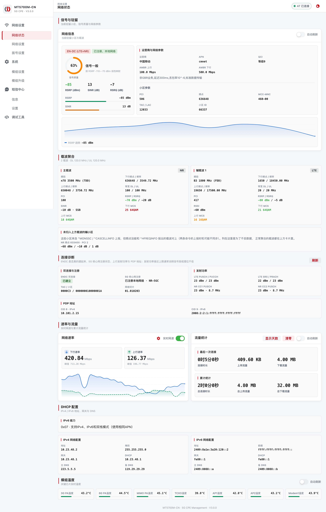
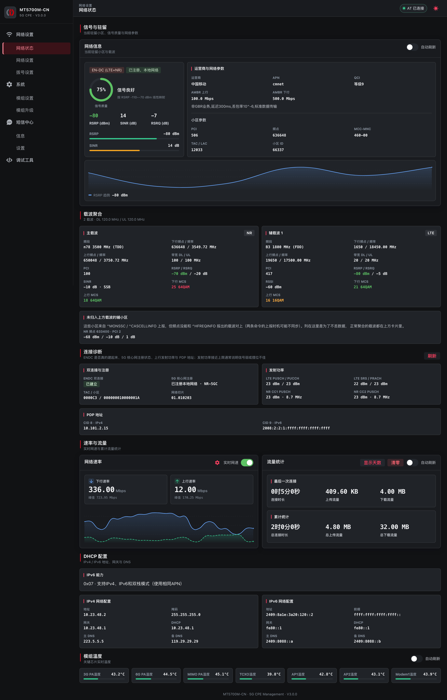
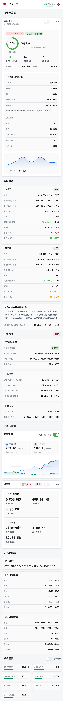
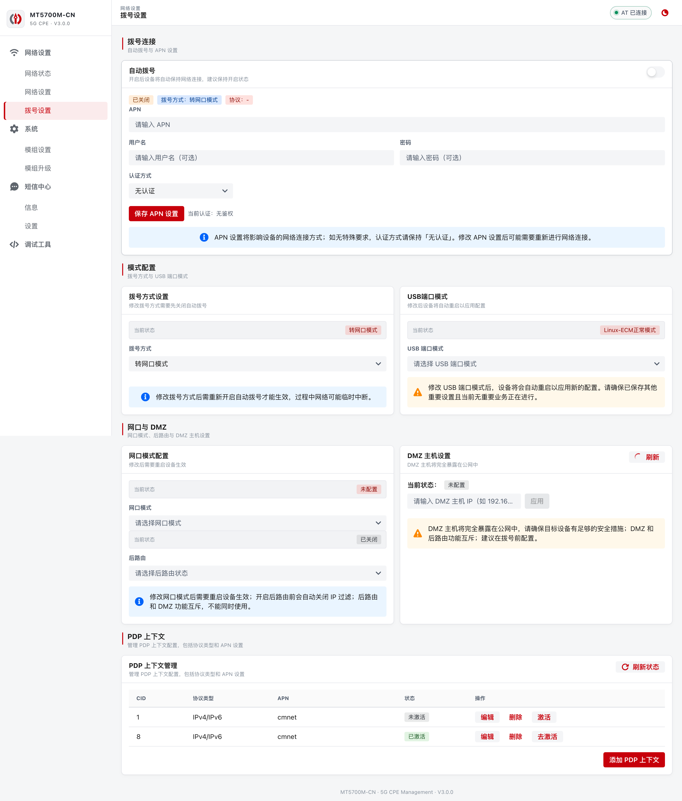
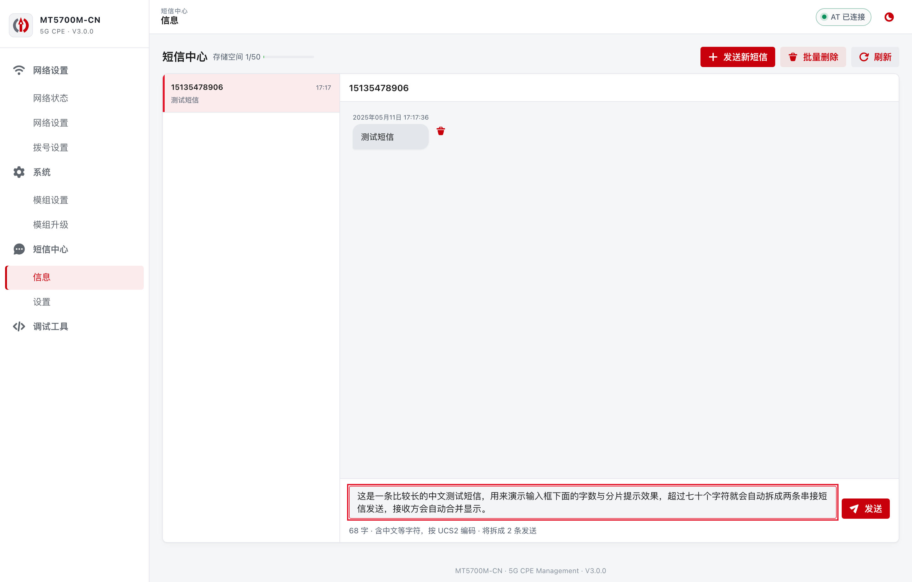
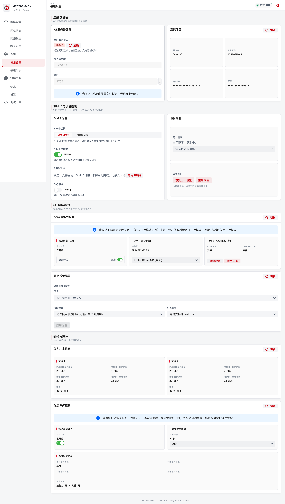

# MT5700M WebUI for OpenWrt

[](https://github.com/LianXia233/luci-app-mt5700m/actions/workflows/ci.yml)

MT5700M-CN 5G 模组的 OpenWrt Web 管理界面：Rust 单二进制后端（`at-webserver`）通过 WebSocket 直连模组 AT 口，前端为 React + Semi Design（`semi-tcpweb`），无需 Python 运行时。

> **本目录是上游 [inotdream/mt5700webui-openwrt-server](https://github.com/inotdream/mt5700webui-openwrt-server) v3.0.2 的归档**。前端与 Rust 后端由 `scripts/build-release.sh` 折叠进 `luci-app-mt5700m` 包，不产生独立的 `at-webserver` / `luci-app-at-webserver` 包。安装与使用说明见仓库根 [README.md](../README.md)。



## 功能

- **信号仪表盘**：RSRP/SINR 质量条与环形信号评分、信号趋势曲线、实时网速波形与流量统计
- **载波聚合**：主/辅载波频点、带宽、每载波信号质量与 MCS，EN-DC 与 5G 注册状态诊断
- **锁频锁小区（4G/5G）**：锁频点 / 锁小区 / 锁 Band，多条锁定项，ARFCN/PCI 输入校验
- **全网扫频**：`AT^CELLSCAN` 异步流式出结果、可随时打断、扫描结果一键锁定
- **定时锁频编排**：日间/夜间两套锁频方案定时切换，可选飞行模式过渡、失服自动解锁
- **短信**：会话视图、长短信自动分片（GSM-7/UCS2 自动选择编码）、USSD 查询
- **SIM 管理**：PIN/PUK 状态全局弹窗解锁、PIN 码启停与修改
- **AT 调试终端**：结构化收发日志、常用命令快捷键、自定义命令收藏
- **拨号管理**：APN/认证方式、拨号模式、PDP 上下文增删与激活、DMZ、网口模式
- **模组管理**：5G 接入模式（SA/NSA/DSS）、发射功率、芯片温度监控、模组升级
- 暗色模式、移动端自适应布局、WebSocket 密钥鉴权

| 暗色模式 | 移动端 |
| :---: | :---: |
|  |  |

<details>
<summary><b>更多截图（锁频/扫频、拨号、短信、AT 终端、系统信息）</b></summary>









</details>

## 源码构建

**前端**（产物会同步到 `at-webserver/files/www/5700`，随包发布）：

```sh
cd semi-tcpweb
npm ci
npm run build && ./scripts/sync-www.sh
```

**Rust 后端**（std-only 零第三方依赖，无需 cargo 索引）：

```sh
cd at-webserver
cargo build --release --offline
```

**完整发布包**由仓库根 `scripts/build-release.sh` 构建：编译 Rust 后端 → 折叠进 `luci-app-mt5700m` → OpenWrt SDK 打包。

## 目录结构

| 目录 | 说明 |
| --- | --- |
| `at-webserver/` | Rust 后端源码与运行时文件（init.d、UCI 配置、WebUI 构建产物） |
| `semi-tcpweb/` | WebUI 前端源码（Vite + React + Semi Design） |
| `docs/` | 文档与截图 |

WebSocket 协议与伪命令（`AT+SCHED`、`AT^CELLSCAN` 等）见 [`at-webserver/API.md`](at-webserver/API.md)。
